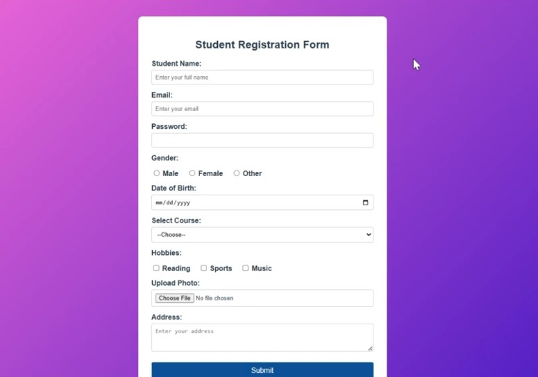

# Student Registration Form

A simple and responsive **Student Registration Form** built using HTML and CSS.

## Preview

## Features

- Responsive design for desktop and mobile
- Student name, email, and password fields
- Gender selection
- Date of birth
- Course selection
- Hobbies
- Photo upload
- Address field
- Submit button
- CSS gradient background

## Technologies

- HTML5
- CSS3

## How to Run

1. Download or clone this repository.
2. Open `index.html` in your browser.